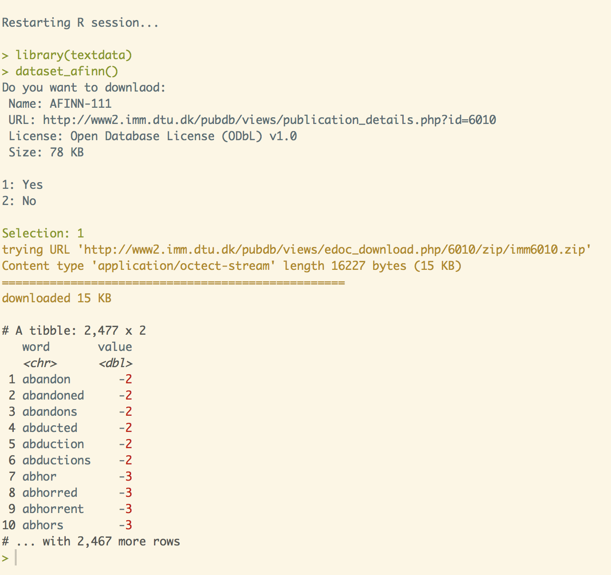

<!-- README.md is generated from README.Rmd. Please edit that file -->
textdata
========

<!-- badges: start -->
<!-- badges: end -->
The goal of textdata is to build a repository of text related data sets for easy access without bundling them inside a package. This is done by downloading and storeing the datasets on the disk and loading them when needed.

Installation
------------

You can install the not yet released version of textdata from [CRAN](https://CRAN.R-project.org) with:

``` r
install.packages("textdata")
```

And the development version from [GitHub](https://github.com/) with:

``` r
# install.packages("devtools")
devtools::install_github("EmilHvitfeldt/textdata")
```

Example
-------


